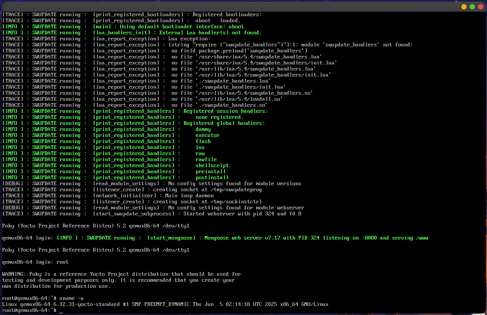

# Yocto-Based Custom Linux Image for IoT Gateway

This project builds a custom Linux image for an IoT Gateway with SWUpdate OTA capabilities using Yocto.

## ✅ Features
- SSH server (Dropbear)
- SWUpdate web server
- Bash, BusyBox, mtd-utils
- QEMU x86-64 Machine
- Auto-login to root

## 🧱 Layers
- Poky
- meta-openembedded
- meta-swupdate
- meta-custom (your custom layer)

## 🛠️ Build Instructions

```bash
cd poky
source oe-init-build-env ../build
bitbake custom-iot-image
runqemu qemux86-64 custom-iot-image

## 🖼️ QEMU Boot Screen

Below is a snapshot of the custom IoT image running in QEMU:


